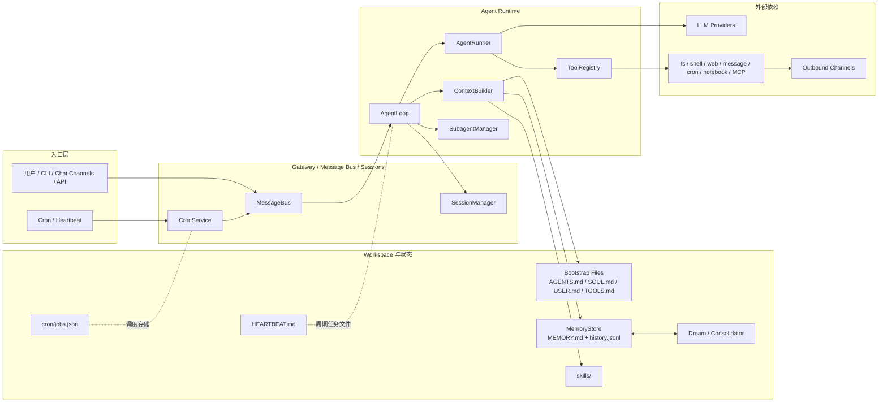
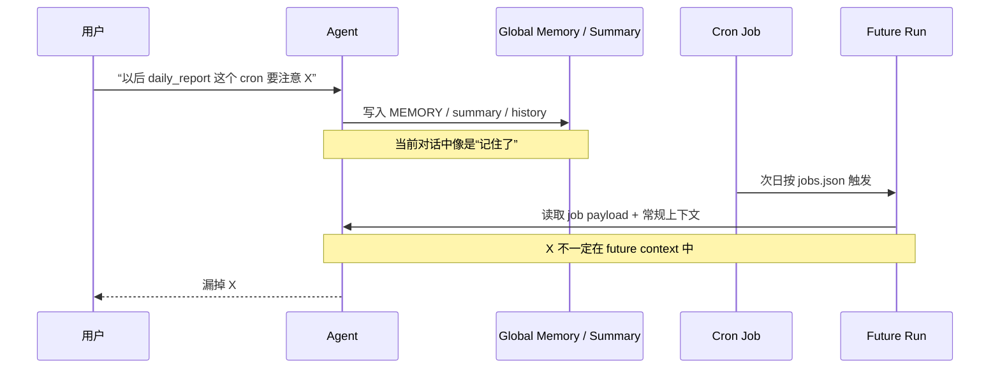
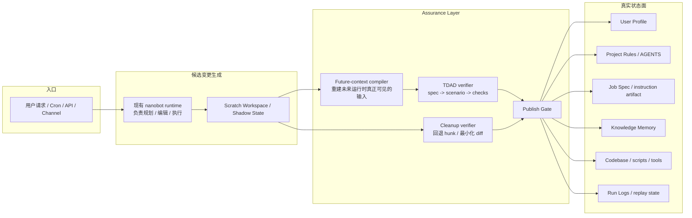
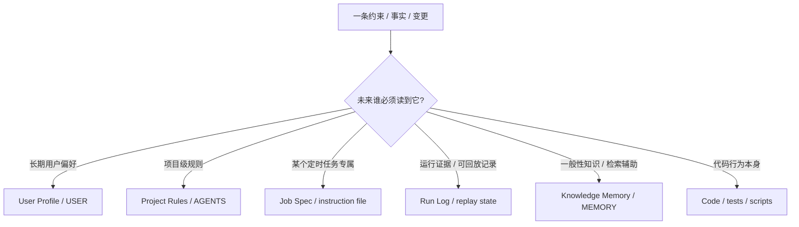
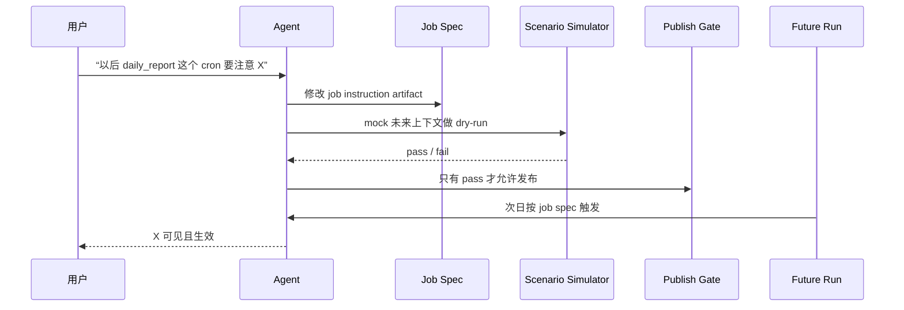
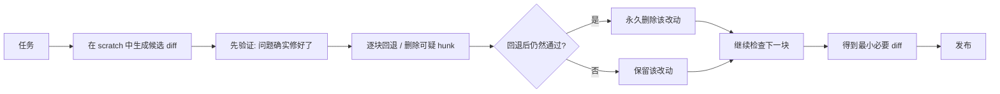
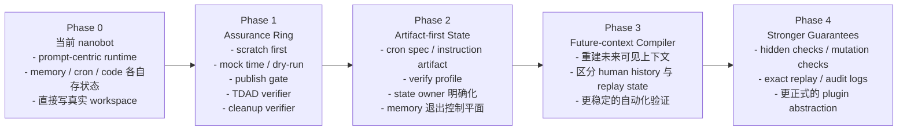

# nanobot 架构总结与演进蓝图（含图）

> 这是一份面向迭代计划的架构文档。重点不是具体文件怎么改，而是：
> 1. 当前 nanobot 架构的本质；
> 2. 为什么它会自然暴露出我们今天讨论的两个问题；
> 3. 理想中的可验证 nanobot 应该长什么样；
> 4. 在不破坏 nanobot 简洁、松耦合、易改动特性的前提下，应该如何演进。
>
> 本文中的图均使用 Mermaid。若当前预览器不渲染 Mermaid，可在 GitHub、Obsidian、Typora 或支持 Mermaid 的 Markdown 预览器中查看。

---

## 1. 一页结论

今天讨论的两个问题，其实不是彼此独立的小 bug，而是同一类架构问题的两个症状：

1. **source-of-truth 错位**：约束被写进了“好写的地方”，而不是“未来执行一定会读到的地方”。
2. **过期修改残留**：agent 会不断试错，但没有机制清理已经失效的改动，于是把试错痕迹沉积成技术债。

因此，下一轮架构演进的重点不应该是“让 memory 更聪明”或者“让 prompt 更长”，而应该是：

- 把状态重新分层，给每类约束明确 owner；
- 把“未来是否真的能工作”变成**可执行验证**，而不是自然语言承诺；
- 把“问题修好了”之外，再加一层“最终保留的改动是否仍然必要”；
- 把这些保证能力**放在 agent 外面**，作为一个外置的 assurance layer，而不是继续塞进 agent 的脑子里。

这意味着我们理想中的 nanobot，不是“更会记”的 nanobot，而是“**更会证明、更会回放、更会清理**”的 nanobot。

---

## 2. 当前 nanobot 架构：它已经很有价值，但仍然是 prompt-centric runtime

nanobot 当前这一代架构，已经明显比最早期的“一个大 loop 包办一切”更成熟。`v0.1.4.post6` 是一个关键拐点：官方明确把它描述成 runtime decomposition 的结构性节点，提到 `AgentRunner` 被抽出来、生命周期 hooks 被统一、命令路由也更可组合。`v0.1.5` 又把 long-running tasks 和 Dream 两阶段 memory 稳定下来，`v0.1.5.post1` 则继续补 cron、memory、retry、channel 等可靠性问题。[^release-0146][^release-015][^release-015p1]

所以，我们今天讨论的出发点不是“nanobot 太乱不能用”，而是：**它已经足够干净，正好适合作为下一轮可验证层的底座。**

### 2.1 当前 nanobot 的高层结构

这个结构里，已经能看到 nanobot 的几个明显优点：

- **runtime 足够小**：主循环、上下文构造、runner、tool registry、memory、cron 这些角色已经能被单独理解；[^release-0146][^hooks-doc]
- **workspace 是一等概念**：`AGENTS.md`、`SOUL.md`、`USER.md`、`MEMORY.md`、`skills/`、`HEARTBEAT.md` 都是 agent 会真正读取和修改的工件；[^context-builder][^memory-doc][^readme-heartbeat]
- **memory 已经分层**：`session.messages`、`history.jsonl`、`SOUL.md` / `USER.md` / `MEMORY.md` 不再被当成同一个东西；Dream 还会用 git-versioned 的方式记录 durable memory 的变化。[^memory-doc][^release-015]
- **扩展缝已经存在**：SDK hooks 已经能在 `before_iteration`、`before_execute_tools`、`after_iteration`、`finalize_content` 等节点做观察和改造。[^hooks-doc]

这些特性非常重要，因为它们意味着我们不必一上来就推倒重写。

### 2.2 当前架构的本质：它仍然是“围绕 prompt 和运行时拼装”的系统

虽然 nanobot 已经有分层，但它当前仍然主要是一个 **prompt-centric runtime**：

- `ContextBuilder` 每轮都会重新从 identity、bootstrap files、memory、skills、recent history 构造 system prompt；
- runtime metadata（当前时间、channel、chat_id、session summary）会被注入到本轮 user message；
- `AgentLoop` 仍然承担了“接消息、拼上下文、跑 LLM、执行工具、写回状态”的核心责任；
- cron 侧虽然有 `CronService`，但 payload 仍然长期偏向“给未来的 agent 投递一段 message”。[^context-builder][^issue-prompt-replay][^issue-cron-command]

换句话说，**nanobot 当前已经不是乱的，但它仍然主要在“运行期拼装正确上下文”，而不是“把未来执行所需的行为契约先建模成一等工件”。**

---

## 3. 为什么当前架构会自然暴露出我们今天讨论的两个问题

### 3.1 问题一：source-of-truth 错位

最典型的例子，就是你今天说的：

> “以后某个 cron 工作要注意 XXX。”

agent 可能会把这条约束写进 memory、history summary，甚至某种通用备注里；当前对话里看起来像是“已经记住了”。但**未来 cron 真运行时，真正被读取的上下文不一定包含这条东西**。于是从用户视角看，就是“明明已经交代过了，结果自动执行的时候还是忘了”。[^context-builder][^issue-prompt-replay][^issue-cron-schema]

#### 当前模式下，这个错误是怎么产生的

这个问题的根因不是“模型健忘”，而是：

- 系统允许多种持久化面同时存在；
- 但没有强制规则说明“某类约束必须写进哪一种状态”；
- 所以 agent 会把信息写进**最容易写**的地方，而不是**未来一定会读**的地方。

### 3.2 问题二：过期修改残留

代码修改场景下，agent 经常会先试一个方向 A，再试方向 B。最后目标 case 可能是被 B 修好的，但 A 的改动经常还留在最终 diff 里，成为未来维护者看不懂的历史沉积。

#### 当前模式下，这个错误是怎么产生的

从目标函数看，当前多数 agent 只优化：

- **Sufficiency**：问题现在是否已经过？

但没有显式优化：

- **Necessity**：最终保留下来的每一块修改是否仍然必要？

这就是为什么 agent 特别容易把过期假设和试错痕迹留在系统里。

### 3.3 这两个问题背后的共同根因

它们表面不同，底层其实是一回事：

1. **状态 ownership 不清**：memory、规则、job spec、run history、代码、workspace 文件之间没有明确 owner。  
2. **future execution context 不可重建**：系统更擅长“当前拼 prompt”，不擅长“重建未来那个场景真正会看到什么”。  
3. **缺少可执行验收**：很多“完成”只是语言层面的完成，不是 contract 层面的完成。  
4. **缺少最小化发布门**：通过了就发，但不会再问“哪些改动现在已经可以删掉了”。

此外，nanobot 社区自己也已经碰到了一些与此同源的现象：

- prompt prefix 不是精确 replay，而是每轮重建；[^issue-prompt-replay]
- session / memory 的大小与预算会互相挤压，失败时可能把长期运行会话拖死；[^issue-session-growth]
- cron payload 仍然相对单薄，`message` 的 schema 与 runtime 期望之间也出现过错位；[^issue-cron-command][^issue-cron-schema][^issue-cron-deliver]
- 社区已经有人提出 provider / channel / memory 这些 extension seam 应该拥有更正式的抽象层。[^issue-plugin-abstraction]

---

## 4. 我们理想中的 nanobot：artifact-first + verifiable + cleanup-aware

理想架构不是“更大更复杂的 nanobot”，而是**把现有 nanobot 的生成与执行能力，包进一个更强的发布前保证层**。

### 4.1 理想架构的核心原则

1. **Artifact first，memory second**  
   任何会影响未来自动执行的约束，都应优先写入带 owner 的 artifact，而不是写进通用 memory。

2. **一条约束必须有唯一 owner**  
   用户长期偏好、项目规则、job 级约束、运行证据、一般知识，必须落在不同的状态面里。

3. **先模拟未来，再发布现在**  
   agent 不能只凭“当前看起来对了”来宣布完成，而必须重建未来执行场景并验证。

4. **验证在 agent 外部完成**  
   真正的裁判应当是 test / simulator / diff minimizer / publish gate，而不是同一个模型再想一遍。

5. **通过验收不够，还要清理多余改动**  
   发布条件必须同时满足 Sufficiency 和 Necessity。

### 4.2 理想架构图

这个图里最关键的变化只有三条：

- **任何持久化写入都先落在 scratch**，而不是直接进真实 workspace；
- **future-context compiler** 会重建“未来那次运行真正能看到什么”；
- **publish gate** 只有在 TDAD verifier 和 cleanup verifier 都通过后，才允许把候选变更提升为真实状态。

### 4.3 状态 ownership 图

这个 ownership 图看起来简单，但它实际上是整个下一轮架构的核心：

> **只要某个约束没有 owner，它迟早就会被写进错误的位置。**

### 4.4 source-of-truth 问题在理想架构里怎么解决

这时，“记住一条话”不再算完成；**只有“未来运行真的能看到并执行它”才算完成。**

### 4.5 cleanup 问题在理想架构里怎么解决

这时，agent 的停止条件就不再只是“修好了”，而是：

- **修好了**；
- **并且最终留下来的改动都是删不掉的。**

---

## 5. “TDAD + Cleanup Verifier” 在这套架构中的角色

### 5.1 TDAD：证明“未来真的能达到目标”

在这份设计里，TDAD 不一定非要从论文版的完整编译链起步。它的最小可用含义是：

- 给一个目标规格；
- 把目标规格编译成可执行检查；
- 在隔离环境中模拟未来场景；
- 只有检查通过，才允许发布。

对于提醒 / cron 这类任务，它本质上就是“高级单测 + 场景模拟”：

- 08:59 不发；
- 09:00 正好发一次；
- 重启后不重复；
- 删除任务后不再发；
- 修改说明后，未来运行真的能读取新说明。

所以 TDAD 在这里扮演的是：

> **future behavior verifier**

### 5.2 Cleanup Verifier：证明“留下来的改动仍然必要”

cleanup verifier 的目标不是再修一次问题，而是：

- 把已经修好的 candidate diff 再做一次逆向验证；
- 删除不再必要的改动；
- 把发布目标从“能过”收缩到“只留下必要部分”。

所以 cleanup verifier 在这里扮演的是：

> **minimal-change publisher**

### 5.3 二者的分工关系

- **TDAD** 负责判断“这次改动能不能让未来行为成立”。
- **Cleanup Verifier** 负责判断“最终留下来的改动是不是已经尽可能小”。

一个解决“能否达到目标”，另一个解决“是不是留下了不该留的东西”。

---

## 6. 如何演进：不是推翻 nanobot，而是在外面加 assurance ring

### 6.1 演进总原则

这次架构演进最重要的选择，不是“从哪里重写”，而是：

> **尽量不改 nanobot 的主循环语义，优先把新能力做成外置保证层。**

原因很简单：

- nanobot 当前最大的优点，就是代码体量小、路径短、容易读；[^readme-root]
- `v0.1.4.post6` 之后，runtime 已经出现了比较好的解耦边界；[^release-0146]
- hooks、runner、workspace、Dream、Heartbeat 这些现有机制，已经足够支撑第一轮 assurance ring。[^hooks-doc][^memory-doc][^readme-heartbeat]

也就是说，**下一步最划算的，不是先把 nanobot 改成一个全新的大框架，而是先把“候选变更 -> 隔离验证 -> 发布闸机”这条外层通路建起来。**

### 6.2 演进路线图

### 6.3 各阶段的目标

#### Phase 1：先加 assurance ring

这是收益最大、破坏最小的一步。

目标不是改掉 nanobot 的一切，而是先建立：

- scratch workspace / shadow state；
- cron / reminder 的 dry-run 与 mock clock；
- 发布前的 TDAD verifier；
- 发布前的 cleanup verifier；
- 真实状态只经 publish gate 修改。

这一阶段完成后，哪怕 state ownership 还没完全类型化，你也已经能避免最危险的两类问题：

- 没验证就宣布完成；
- 过期改动不清理就直接发布。

#### Phase 2：把“真正负责未来行为的工件”抬成一等对象

这是把 source-of-truth 错位真正从根上压下去的一步。

目标是把这些状态面明确出来：

- 用户长期偏好；
- 项目规则；
- job spec / instruction；
- 运行证据；
- 知识记忆；
- 代码 / 测试。

这一步的关键，不是“多建一些文件”，而是让系统有能力明确回答：

> 这条约束，到底由谁负责？

#### Phase 3：引入 future-context compiler

这是让“验证未来行为”真正站稳的一步。

当前 nanobot 更擅长每轮重新拼 prompt；而理想中的可验证系统，需要一个更强的编译器：

- 它能重建某个 job / 某次自动化运行 / 某次 cron tick 实际可见的输入；
- 它不依赖当前聊天上下文；
- 它把 runtime metadata、artifact、memory、history、skills 的可见性边界说清楚；
- 它支持 dry-run、回放和审计。

一旦这一步存在，很多“看起来记住了，其实未来不可见”的问题会自动暴露出来。

#### Phase 4：再考虑更强的 guarantees 和插件化表面

只有在 Phase 1–3 建起来之后，再讨论更强的特性才值得：

- hidden checks / mutation checks；
- exact replay state；
- 更正式的 provider / channel / memory / verifier abstraction；
- 更独立的 assurance SDK。

否则，很容易陷入“加了很多新概念，但核心验证路径还没立起来”的情况。

---

## 7. 这轮演进中，哪些东西应该刻意保持不变

为了保住 nanobot 的优势，下面这些东西应尽量不要在第一阶段动得太大：

1. **AgentLoop 仍然是主执行器**  
   不要一开始就把它拆成过多微服务或过度抽象的 orchestration graph。

2. **workspace-first 的工程风格要保留**  
   `AGENTS.md`、`USER.md`、`SOUL.md`、`skills/`、`HEARTBEAT.md` 这些面向工件的设计，其实恰好是我们理想方向的一部分。[^context-builder][^memory-doc][^readme-heartbeat]

3. **hooks / runner 继续作为现有注入缝**  
   第一轮不必追求最优雅的 framework 级 API，能以最小入侵接入 verifier 就够了。[^hooks-doc][^release-0146]

4. **memory 不要被彻底推翻**  
   Dream 的 layered memory 思想本身没错；问题在于它不该继续承担 job control plane 的职责。[^memory-doc][^release-015]

所以，架构方向应该是：

> **保留 nanobot 作为 runtime 内核；把 verifiability 和 cleanup 作为新的外环。**

---

## 8. 对未来迭代计划最有价值的设计判断

如果把今天所有讨论压缩成几条能指导后续迭代计划的判断，我会留下这几条：

### 判断 1
**问题不在于 agent 不够聪明，而在于系统没有要求它证明自己真的把状态写对了。**

### 判断 2
**memory 不是控制平面。**

memory 适合做长期知识、检索辅助、历史归纳；但凡影响未来自动执行的约束，都不该只落在那里。

### 判断 3
**“未来能否工作”必须被建模成可执行验证，而不是一句自然语言承诺。**

### 判断 4
**发布目标必须同时包含 sufficiency 和 necessity。**

也就是：

- 不仅要“能过”；
- 还要“最终留下来的东西删不掉”。

### 判断 5
**第一步不该是重写 nanobot，而该是先建立 assurance ring。**

这是最小改动、最高收益、最不容易把系统复杂度一下推爆的路线。

---

## 9. 这份文档可以直接展开成哪些后续文档

这份架构总结适合作为以下几类后续文档的母文档：

1. **迭代计划 / roadmap**  
   按 Phase 1–4 拆里程碑、验收标准、风险和依赖。

2. **概念设计说明（Concept Design）**  
   展开 state owner、future-context compiler、TDAD verifier、cleanup verifier 的职责边界。

3. **ADR（Architecture Decision Records）**  
   例如：
   - 为什么 verifier 必须外置；
   - 为什么 memory 不承担 job control plane；
   - 为什么所有持久化变更必须 scratch first。

4. **测试与验收策略文档**  
   定义哪些场景属于 visible checks，哪些属于 hidden checks，哪些属于 cleanup minimization checks。

---

## 10. 参考结论：我们要构建的不是“更会聊天的 nanobot”，而是“更会自证和自清理的 nanobot”

从今天的讨论看，最值得坚持的方向不是再去追求一种“万能 memory”或者“更长的 prompt”，而是把 nanobot 逐步演进成一种更像工程系统的 agent runtime：

- 它能明确知道一条约束应该写在哪里；
- 它能在发布前模拟未来场景；
- 它能证明某次变更确实支持未来目标；
- 它能清理自己试错过程中留下的冗余修改；
- 它能把“完成”从语言感觉，变成可执行、可回放、可审计的事实。

这就是这轮架构演进真正要解决的问题。

---

## 参考资料

[^readme-root]: HKUDS/nanobot 仓库 README（当前主仓库与项目概览）：https://github.com/HKUDS/nanobot
[^release-0146]: nanobot `v0.1.4.post6` release notes，重点包括 runtime decomposition、`AgentRunner` 抽取、生命周期 hooks 统一、命令路由重构与整体结构性转折：https://github.com/HKUDS/nanobot/releases/tag/v0.1.4.post6
[^release-015]: nanobot `v0.1.5` release notes，重点包括 long-running task reliability 与 Dream 两阶段 memory architecture：https://github.com/HKUDS/nanobot/releases/tag/v0.1.5
[^release-015p1]: nanobot `v0.1.5.post1` release notes，重点包括 auto compact、mid-turn injection，以及 cron / memory / retry / channels 的进一步稳定化：https://github.com/HKUDS/nanobot/releases/tag/v0.1.5.post1
[^context-builder]: `ContextBuilder` 当前实现：system prompt 由 bootstrap files、memory、skills、recent history 等重建，runtime metadata 注入当前 user message：https://github.com/HKUDS/nanobot/blob/main/nanobot/agent/context.py
[^memory-doc]: `docs/MEMORY.md`，当前 memory 的两阶段设计：`session.messages`、`history.jsonl`、`SOUL.md` / `USER.md` / `MEMORY.md` 与 Dream / GitStore 的角色：https://github.com/HKUDS/nanobot/blob/main/docs/MEMORY.md
[^hooks-doc]: `docs/PYTHON_SDK.md`，当前公开的 hooks 能力：`before_iteration`、`before_execute_tools`、`after_iteration`、`finalize_content` 等：https://github.com/HKUDS/nanobot/blob/main/docs/PYTHON_SDK.md
[^readme-heartbeat]: README 中的 Heartbeat 说明：gateway 周期性读取 `HEARTBEAT.md`，且 agent 可以自行管理这个文件：https://github.com/HKUDS/nanobot#in-chat-commands
[^issue-prompt-replay]: Issue #2463：当前 nanobot 不把“曾经真正发给模型的 prompt prefix”作为一等持久化对象，而是依赖未来重建：https://github.com/HKUDS/nanobot/issues/2463
[^issue-session-growth]: Issue #2638：当 consolidation 失败时，session history 与 `MEMORY.md` 预算会继续膨胀，并可能把长时运行会话拖死：https://github.com/HKUDS/nanobot/issues/2638
[^issue-cron-command]: Issue #2309：社区指出 `jobs.json` 长期主要还是“给 agent 投递指令”，而 `system_event` 等更强语义并未成为主路径：https://github.com/HKUDS/nanobot/issues/2309
[^issue-cron-schema]: Issue #3113：cron tool 的 schema 与 runtime 对 `message` 的要求出现错位，暴露出 cron 任务模型仍偏薄：https://github.com/HKUDS/nanobot/issues/3113
[^issue-cron-deliver]: Issue #3115：`deliver: false` 的行为与 runtime 输出路径之间仍有耦合/漏控问题：https://github.com/HKUDS/nanobot/issues/3115
[^issue-plugin-abstraction]: Issue #2894：社区已经把 provider / channel / memory 视作自然 extension seam，并建议提供更正式的高层抽象：https://github.com/HKUDS/nanobot/issues/2894

